# 📚 LangChain Embeddings - Complete Learning Guide

Welcome to the **Embeddings Module** of the LangChain learning series! This guide provides a comprehensive overview of text embeddings and how to use them with LangChain.

---

## 🗺️ Module Overview


---

## 🎯 What Are Embeddings?

**Embeddings** transform text into numerical vectors that capture semantic meaning. Similar texts have similar vectors, enabling powerful semantic search and AI applications.


---

## 📓 Notebooks in This Module

| # | Notebook | Provider | Cost | Description |
|---|----------|----------|------|-------------|
| 1 | [4.1-embedding.ipynb](4.1-embedding.ipynb) | 🟢 **OpenAI** | 💰 Paid | Cloud-based, highest quality embeddings |
| 2 | [4.2-ollamaemnedding.ipynb](4.2-ollamaemnedding.ipynb) | 🦙 **Ollama** | 🆓 Free | Local, private embedding generation |
| 3 | [4.3-huggingface.ipynb](4.3-huggingface.ipynb) | 🤗 **HuggingFace** | 🆓 Free | Open-source sentence transformers |

---

## 🏗️ Architecture Overview


---

## 📊 Provider Comparison

### Feature Matrix

| Feature | OpenAI | Ollama | HuggingFace |
|---------|:------:|:------:|:-----------:|
| **Cost** | 💰 Paid | 🆓 Free | 🆓 Free |
| **Privacy** | ☁️ Cloud | 🏠 Local | 🏠 Local |
| **Quality** | ⭐⭐⭐⭐⭐ | ⭐⭐⭐ | ⭐⭐⭐⭐ |
| **Speed** | ⚡⚡⚡⚡ | ⚡⚡ | ⚡⚡⚡ |
| **Offline** | ❌ | ✅ | ✅ |
| **Setup** | API Key | Install App | pip install |

### Embedding Dimensions


---

## 🔧 Quick Start Guide

### 1️⃣ OpenAI Embeddings (Best Quality)

```python
from langchain_openai import OpenAIEmbeddings

# Initialize
embeddings = OpenAIEmbeddings(model="text-embedding-3-large")

# Embed text
vector = embeddings.embed_query("Your text here")
```

### 2️⃣ Ollama Embeddings (Free & Local)

```python
from langchain_community.embeddings import OllamaEmbeddings

# Initialize (requires Ollama installed)
embeddings = OllamaEmbeddings(model="mxbai-embed-large")

# Embed text
vector = embeddings.embed_query("Your text here")
```

### 3️⃣ HuggingFace Embeddings (Open Source)

```python
from langchain_huggingface import HuggingFaceEmbeddings

# Initialize
embeddings = HuggingFaceEmbeddings(model_name="all-MiniLM-L6-v2")

# Embed text
vector = embeddings.embed_query("Your text here")
```

---

## 🔄 The RAG Pipeline

```mermaid
sequenceDiagram
    participant U as 👤 User
    participant E as 🧠 Embeddings
    participant V as 🗃️ Vector Store
    participant L as 🤖 LLM
    
    Note over U,L: 📥 Indexing Phase
    U->>E: Load Documents
    E->>E: Split into Chunks
    E->>E: Generate Embeddings
    E->>V: Store Vectors
    
    Note over U,L: 🔍 Query Phase
    U->>E: Ask Question
    E->>E: Embed Query
    E->>V: Similarity Search
    V->>E: Return Top K Results
    E->>L: Query + Context
    L->>U: Generated Answer
```



---

## 📈 Learning Path


### Recommended Order:

1. **[4.1-embedding.ipynb](4.1-embedding.ipynb)** - Start here to understand embedding fundamentals with OpenAI
2. **[4.2-ollamaemnedding.ipynb](4.2-ollamaemnedding.ipynb)** - Learn about local, free alternatives
3. **[4.3-huggingface.ipynb](4.3-huggingface.ipynb)** - Explore the open-source ecosystem

---

## 🎓 Key Concepts

### Embedding Methods

| Method | Purpose | Example Use |
|--------|---------|-------------|
| `embed_query()` | Single text | Search queries |
| `embed_documents()` | Multiple texts | Document indexing |

### Text Splitting Parameters

| Parameter | Description | Typical Value |
|-----------|-------------|---------------|
| `chunk_size` | Max characters per chunk | 500-1000 |
| `chunk_overlap` | Shared chars between chunks | 50-100 |

### Vector Store Operations

| Operation | Description |
|-----------|-------------|
| `from_documents()` | Create store from docs |
| `similarity_search()` | Find similar chunks |
| `add_documents()` | Add new documents |

---

## 📦 Dependencies

```bash
# Core
pip install langchain langchain-community

# OpenAI
pip install langchain-openai

# HuggingFace
pip install langchain-huggingface sentence-transformers

# Vector Store
pip install chromadb

# Environment
pip install python-dotenv
```

---

## 🔗 Additional Resources

- 📖 [LangChain Documentation](https://python.langchain.com/docs/modules/data_connection/text_embedding/)
- 🧠 [OpenAI Embeddings Guide](https://platform.openai.com/docs/guides/embeddings)
- 🦙 [Ollama Embedding Models](https://ollama.com/blog/embedding-models)
- 🤗 [HuggingFace Sentence Transformers](https://huggingface.co/sentence-transformers)
- 📊 [MTEB Leaderboard](https://huggingface.co/spaces/mteb/leaderboard)

---

## ✅ Summary Checklist

After completing this module, you should be able to:

- [ ] Explain what embeddings are and why they're useful
- [ ] Use OpenAI embeddings with LangChain
- [ ] Set up local embeddings with Ollama
- [ ] Use HuggingFace sentence transformers
- [ ] Load and split documents for embedding
- [ ] Store embeddings in ChromaDB
- [ ] Perform similarity search on embedded documents
- [ ] Choose the right embedding provider for your use case

---

<div align="center">

**Happy Learning! 🚀**

*Created as part of the LangChain Learning Series*

</div>
