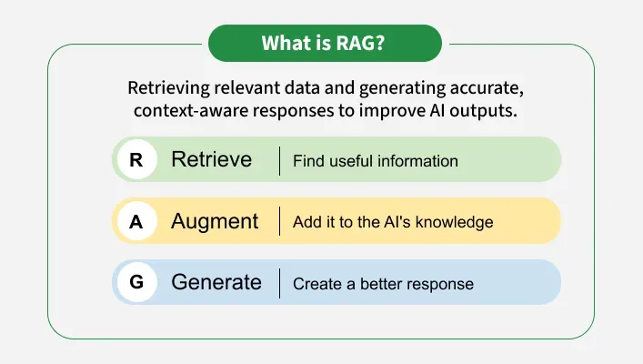

# Mastering RAG Applications with LangChain: The Complete Developer's Guide 🚀

## Unlocking the Power of Retrieval-Augmented Generation

In the rapidly evolving world of Generative AI, one architectural pattern has emerged as the game-changer for building intelligent, context-aware applications: **Retrieval-Augmented Generation (RAG)**. This revolutionary framework combines the power of information retrieval with advanced language models to create AI systems that are not only intelligent but also factually grounded and up-to-date.

Let's embark on a comprehensive journey to understand how RAG works and how LangChain makes building these sophisticated systems accessible to developers at all levels.

---

## 🎯 What is RAG and Why Does It Matter?



**RAG** is an advanced AI framework that bridges the gap between static language models and dynamic, real-world knowledge. Instead of relying solely on pre-trained data (which becomes outdated quickly), RAG actively retrieves relevant information from external sources before generating responses.

### The Traditional LLM Problem 🤔

Traditional Large Language Models (LLMs) face critical limitations:

- **📅 Static Knowledge**: Trained on fixed datasets with a knowledge cutoff date
- **🎲 Hallucinations**: Generate plausible-sounding but incorrect information
- **🔒 No Real-Time Updates**: Cannot access current events or latest data
- **💰 Expensive Updates**: Require costly retraining to incorporate new knowledge

### The RAG Solution ✨

RAG transforms these limitations into strengths by:

```
┌─────────────────────────────────────────────────────┐
│                    Traditional LLM                   │
├─────────────────────────────────────────────────────┤
│  User Query → LLM (trained data only) → Response    │
│                                                      │
│  Problem: Limited to training data, prone to         │
│  hallucinations, outdated information                │
└─────────────────────────────────────────────────────┘

                        ⬇️

┌─────────────────────────────────────────────────────┐
│                      RAG System                      │
├─────────────────────────────────────────────────────┤
│  User Query → Retrieve External Data → Augment      │
│  Prompt → LLM (with context) → Grounded Response    │
│                                                      │
│  Benefit: Current data, factually accurate,         │
│  domain-specific expertise                           │
└─────────────────────────────────────────────────────┘

```

---

## 🎨 Real-World RAG Analogy: The Smart Librarian

Imagine you're a librarian (the AI) in a vast library (your knowledge base):

**Traditional Approach** 🏛️

You only answer questions based on what you've memorized from books you read years ago.

**RAG Approach** 📚

When someone asks a question, you:

1. **Search** 🔍 the library shelves for relevant books
2. **Read** 📖 the specific pages containing the answer
3. **Synthesize** 💡 the information with your existing knowledge
4. **Provide** 🎁 an accurate, cited response

This is exactly what RAG does—but at lightning speed with millions of documents!

---

## 🌟 Why RAG is Revolutionizing AI Applications

### 1. **Access to Fresh, Real-Time Knowledge** 🔄

- No more outdated responses
- Connect to live databases, APIs, or document repositories
- Stay current without expensive model retraining

### 2. **Dramatically Reduced Hallucinations** 🎯

- Responses grounded in actual retrieved documents
- Verifiable information with source citations
- Trustworthy AI that users can rely on

### 3. **Domain-Specific Expertise Without Fine-Tuning** 🎓

- Medical records → Healthcare AI assistant
- Legal documents → Legal research tool
- Company docs → Enterprise knowledge base
- Technical manuals → Customer support bot

### 4. **Exceptional Cost Efficiency** 💰

- Update knowledge base instead of retraining billion-parameter models
- Save thousands of dollars in compute costs
- Faster deployment and iteration cycles

### 5. **Personalized User Experiences** 👤

- Retrieve user-specific information
- Reference past interactions
- Tailor responses to individual needs

---

## 🏗️ The Two-Module RAG Architecture

Building a production-ready RAG system involves two interconnected modules:

```
╔═══════════════════════════════════════════════════╗
║           THE COMPLETE RAG PIPELINE               ║
╚═══════════════════════════════════════════════════╝

┌─────────────────────────────────────────────────┐
│  MODULE 1: KNOWLEDGE BASE CONSTRUCTION          │
│  (Build Once, Query Many Times)                 │
└─────────────────────────────────────────────────┘
         │
         ├─→ 📥 Data Ingestion
         ├─→ ✂️ Text Chunking
         ├─→ 🧬 Embedding Generation
         └─→ 💾 Vector Storage

         ⬇️

┌─────────────────────────────────────────────────┐
│  MODULE 2: INTELLIGENT QUERY SYSTEM             │
│  (Real-Time User Interaction)                   │
└─────────────────────────────────────────────────┘
         │
         ├─→ 💬 User Question
         ├─→ 📝 Prompt Engineering
         ├─→ 🔍 Similarity Retrieval
         └─→ 🤖 Contextual Generation

```

---

## 📦 Module 1: Building Your Knowledge Foundation

### Step 1: Data Ingestion - The Gateway to Knowledge 📥

**Mission:** Load diverse data sources into your system

**LangChain's Multi-Source Support:**

| Data Type | Use Cases | LangChain Loaders |
| --- | --- | --- |
| 📄 **PDFs** | Research papers, reports, manuals | `PyPDFLoader` |
| 📊 **Spreadsheets** | Data tables, analytics, records | `UnstructuredExcelLoader` |
| 📝 **Text Files** | Documentation, logs, transcripts | `TextLoader` |
| 🌐 **Web Pages** | Articles, blogs, wikis | `WebBaseLoader` |
| 🗄️ **Databases** | SQL tables, NoSQL collections | `SQLDatabaseLoader` |
| 📧 **Emails** | Communication archives | `OutlookMessageLoader` |
| 🎥 **Videos** | Transcripts, captions | `YoutubeLoader` |
| 🖼️ **Images** | OCR text extraction | `UnstructuredImageLoader` |

```
┌────────────────────────────────────────┐
│      DATA SOURCE ECOSYSTEM              │
├────────────────────────────────────────┤
│                                         │
│   📄 PDF    📊 Excel    🌐 URL          │
│   📝 JSON   🎥 Video    🖼️ Image        │
│   🗄️ SQL    📧 Email    📱 API          │
│                                         │
└────────────┬───────────────────────────┘
             │
      ┌──────▼──────┐
      │   INGEST    │  ← Universal Loaders
      │   ENGINE    │
      └─────────────┘

```

**Why This Matters:** Your AI is only as good as the data it can access. LangChain's comprehensive loaders ensure no data source is left behind.

---

### Step 2: Text Chunking - The Art of Division ✂️

**Mission:** Transform large documents into optimally-sized pieces

**The Context Window Challenge:**

Every LLM has a **maximum context length**:

- GPT-3.5: ~4,096 tokens
- GPT-4: ~8,192 tokens (standard), ~32,768 tokens (extended)
- Claude: ~100,000 tokens
- LLaMA 3: ~8,192 tokens

**Why Chunking is Critical:**

```
❌ Without Chunking:
┌──────────────────────────────────┐
│  1000-page PDF (500K tokens)     │
│  ⚠️ Exceeds context limit        │
│  ⚠️ Poor retrieval precision     │
│  ⚠️ Slow processing              │
└──────────────────────────────────┘

✅ With Smart Chunking:
┌────────┐ ┌────────┐ ┌────────┐
│Chunk 1 │ │Chunk 2 │ │Chunk N │
│500 tok │ │500 tok │ │500 tok │
└────────┘ └────────┘ └────────┘
  ✓ Fits context    ✓ Precise retrieval
  ✓ Fast search     ✓ Better results

```

**LangChain Chunking Strategies:**

| Strategy | Best For | Chunk Size |
| --- | --- | --- |
| **CharacterTextSplitter** | Simple splitting | 500-1000 chars |
| **RecursiveCharacterTextSplitter** | Semantic preservation | 1000-1500 chars |
| **TokenTextSplitter** | Token-aware splitting | 512-1024 tokens |
| **MarkdownTextSplitter** | Structured documents | Variable by header |

**Pro Tip:** Use **overlap** between chunks (10-20%) to maintain context continuity!

---

### Step 3: Embedding Generation - From Text to Math 🧬

**Mission:** Convert text into numerical vectors that capture semantic meaning

**The Vector Magic:** ✨

Words with similar meanings have similar vector representations:

```
Text: "Artificial Intelligence"
Vector: [0.234, -0.567, 0.891, 0.123, -0.456, ...]
        (typically 384 to 1536 dimensions)

Text: "Machine Learning"
Vector: [0.245, -0.552, 0.875, 0.131, -0.441, ...]
        (close in vector space!)

Text: "Pizza Recipe"
Vector: [-0.789, 0.321, -0.145, 0.678, 0.234, ...]
        (distant in vector space)

```

**Why Embeddings Power RAG:**

1. **🎯 Semantic Search**: Find conceptually similar content, not just keyword matches
2. **⚡ Speed**: Mathematical operations on vectors are lightning fast
3. **🔍 Cosine Similarity**: Measure how "close" two pieces of text are

```
┌─────────────────────────────────┐
│    "What causes rain?"          │
│    Vector: [0.23, -0.56, ...]   │
└────────────┬────────────────────┘
             │ Cosine Similarity
             ▼
┌─────────────────────────────────┐
│ "Water cycle and precipitation" │
│ Vector: [0.25, -0.54, ...]      │
│ Similarity: 0.92 (High!) ✅     │
└─────────────────────────────────┘

```

**Popular Embedding Models:**

| Model | Dimensions | Best For | Cost |
| --- | --- | --- | --- |
| 🔵 **OpenAI Ada-002** | 1536 | High accuracy | Paid API |
| 🟢 **Sentence-Transformers** | 384-768 | Open source | Free |
| 🔴 **Google Vertex AI** | 768 | Enterprise | Paid API |
| 🟡 **Cohere Embed** | 1024 | Multilingual | Paid API |

---

### Step 4: Vector Store - The High-Speed Knowledge Vault 💾

**Mission:** Store millions of embeddings and retrieve relevant ones in milliseconds

**Vector Database Superpowers:**

```
Traditional Database:
SELECT * FROM docs WHERE text LIKE '%AI%'
⏱️ Slow, keyword-based, limited

Vector Database:
FIND TOP 5 SIMILAR TO query_vector
⚡ Fast, semantic, powerful

```

**LangChain-Compatible Vector Stores:**

| Database | Deployment | Scale | Best For |
| --- | --- | --- | --- |
| 🔥 **FAISS** | Local | 10M+ vectors | Prototyping, single machine |
| 🎨 **ChromaDB** | Local/Cloud | 1M+ vectors | Development, small teams |
| ⭐ **Pinecone** | Cloud | Billions | Production, serverless |
| 🌲 **Weaviate** | Self-hosted/Cloud | 100M+ vectors | Hybrid search, GraphQL |
| 🚀 **Qdrant** | Self-hosted/Cloud | Billions | High performance, Rust |
| 💫 **Astra DB** | Cloud | Massive scale | Enterprise, Cassandra-based |

**The Storage & Retrieval Flow:**

```
STORAGE PHASE:
┌──────────┐    ┌────────── ┐    ┌──────────────┐
│  Chunks  │ →  │ Embeddings│ →  │Vector Store  │
│ (text)   │    │ (vectors) │    │  + Metadata  │
└──────────┘    └────────── ┘    └──────────────┘

RETRIEVAL PHASE:
┌──────────┐    ┌────────────┐    ┌──────────  ┐
│  Query   │ →  │  Embed     │ →  │ Similarity │
│          │    │  Query     │    │  Search    │
└──────────┘    └────────────┘    └────┬─────  ┘
                                       │
                                       ▼
                               ┌─────────────────┐
                               │  Top K Chunks   │
                               │  Most Relevant  │
                               └─────────────────┘

```

---

## 💬 Module 2: The Query-Response Intelligence Engine

### Component 1: Prompt Engineering - The AI Whisperer 📝

**Mission:** Guide the LLM to behave exactly as needed

**Anatomy of a RAG Prompt:**

```python
prompt_template = """
🎭 ROLE DEFINITION:
You are an expert {domain} assistant with deep knowledge
and analytical capabilities.

📋 TASK:
Answer the user's question based on the provided context.
Be accurate, thorough, and cite sources when possible.

📚 CONTEXT:
{retrieved_context}

❓ USER QUESTION:
{user_question}

✅ INSTRUCTIONS:
1. Only use information from the context
2. If the context doesn't contain the answer, say so
3. Cite specific document sections when relevant
4. Be concise but comprehensive

💡 ANSWER:
"""

```

**Prompt Engineering Best Practices:**

| Technique | Purpose | Example |
| --- | --- | --- |
| **Role Setting** | Define AI behavior | "You are a medical researcher..." |
| **Few-Shot Examples** | Show desired format | Provide 2-3 Q&A examples |
| **Constraints** | Prevent hallucinations | "Only use provided context" |
| **Output Format** | Structure responses | "Use bullet points for lists" |

---

### Component 2: The Retrieval Chain - Your Smart Search Engine 🔗

**Mission:** Bridge the gap between user queries and stored knowledge

**The Retrieval Chain Architecture:**

```
┌──────────────────────────────────────────────────┐
│           RETRIEVAL CHAIN WORKFLOW               │
└──────────────────────────────────────────────────┘

1️⃣ QUERY PROCESSING
   User: "What are the benefits of renewable energy?"
         │
         ▼
   ┌─────────────┐
   │ Query       │
   │ Encoder     │  ← Convert to vector
   └──────┬──────┘
          │

2️⃣ SIMILARITY SEARCH
          │
          ▼
   ┌─────────────┐
   │ Vector      │
   │ Store       │  ← Find similar chunks
   │ Search      │
   └──────┬──────┘
          │

3️⃣ CONTEXT RETRIEVAL
          │
          ▼
   ┌───────────────────────────── ┐
   │ Top 5 Most Relevant Chunks:  │
   │ 1. "Solar power reduces..."  │
   │ 2. "Wind energy provides..." │
   │ 3. "Hydroelectric systems..."│
   │ 4. "Geothermal benefits..."  │
   │ 5. "Biomass advantages..."   │
   └──────┬────────────────────── ┘
          │

4️⃣ CONTEXT AUGMENTATION
          │
          ▼
   ┌─────────────┐
   │ Combine:    │
   │ • Query     │
   │ • Context   │
   │ • Prompt    │
   └──────┬──────┘

```

**LangChain Retrieval Strategies:**

| Chain Type | Use Case | Complexity |
| --- | --- | --- |
| **RetrievalQA** | Basic Q&A | ⭐ Simple |
| **ConversationalRetrievalChain** | Multi-turn chat | ⭐⭐ Medium |
| **MapReduce Chain** | Long documents | ⭐⭐⭐ Advanced |
| **Refine Chain** | Iterative improvement | ⭐⭐⭐ Advanced |

---

### Component 3: LLM Generation - The Final Magic 🤖

**Mission:** Generate intelligent, contextual, and accurate responses

```
┌────────────────────────────────────────────┐
│         GENERATION PIPELINE                │
└────────────────────────────────────────────┘

INPUT TO LLM:
┌──────────────────┐   ┌──────────────────┐
│  System Prompt   │ + │ Retrieved Context│
└──────────────────┘   └──────────────────┘
          │                      │
          └──────────┬───────────┘
                     │
                     ▼
              ┌─────────────┐
              │  LLM Model  │
              │  (GPT-4,    │
              │   Claude,   │
              │   LLaMA)    │
              └──────┬──────┘
                     │
                     ▼
         ┌──────────────────────┐
         │  GENERATED RESPONSE  │
         │  ✅ Contextual       │
         │  ✅ Accurate         │
         │  ✅ Cited            │
         └──────────────────────┘

```

**Response Quality Factors:**

1. **Context Relevance** (40%): Quality of retrieved chunks
2. **Prompt Clarity** (30%): Well-structured instructions
3. **Model Capability** (20%): LLM reasoning ability
4. **Temperature Setting** (10%): Creativity vs precision balance

---

## 🎯 Complete RAG Workflow: Putting It All Together


```
╔═══════════════════════════════════════════════════════╗
║           END-TO-END RAG SYSTEM FLOW                  ║
╚═══════════════════════════════════════════════════════╝

🔧 OFFLINE PHASE (Build Knowledge Base)
─────────────────────────────────────────
📥 Step 1: Ingest Data
   └─→ PDFs, URLs, Databases loaded

✂️ Step 2: Chunk Text
   └─→ Split into 500-1000 token pieces

🧬 Step 3: Generate Embeddings
   └─→ Convert chunks to vectors

💾 Step 4: Store in Vector DB
   └─→ Index for fast similarity search

⚡ ONLINE PHASE (User Interaction)
─────────────────────────────────────────
💬 Step 5: User Asks Question
   └─→ "What causes climate change?"

🔍 Step 6: Retrieve Context
   └─→ Find top 5 similar chunks

📝 Step 7: Augment Prompt
   └─→ Combine query + context + instructions

🤖 Step 8: Generate Response
   └─→ LLM produces grounded answer

✨ Step 9: Deliver to User
   └─→ "Climate change is primarily caused by..."

```

---

## 🛠️ Essential LangChain Components Reference

### Core Building Blocks

| Component | Purpose | Key Classes | Priority |
| --- | --- | --- | --- |
| 📥 **Loaders** | Data ingestion | `PyPDFLoader`, `WebBaseLoader` | 🔴 Critical |
| ✂️ **Splitters** | Text chunking | `RecursiveCharacterTextSplitter` | 🔴 Critical |
| 🧬 **Embeddings** | Vector creation | `OpenAIEmbeddings`, `HuggingFaceEmbeddings` | 🔴 Critical |
| 💾 **Vector Stores** | Storage & retrieval | `FAISS`, `Chroma`, `Pinecone` | 🔴 Critical |
| 🔗 **Chains** | Component orchestration | `RetrievalQA`, `ConversationalRetrievalChain` | 🟡 Important |
| 📝 **Prompts** | LLM instruction | `PromptTemplate`, `ChatPromptTemplate` | 🟡 Important |
| 🤖 **LLMs** | Response generation | `OpenAI`, `ChatOpenAI`, `HuggingFaceHub` | 🔴 Critical |
| 💭 **Memory** | Conversation context | `ConversationBufferMemory` | 🟢 Optional |

---

## 🌍 Real-World RAG Applications

### Industry Use Cases

**1. Enterprise Knowledge Management** 🏢

- **Challenge**: Employees can't find information across thousands of documents
- **RAG Solution**: Natural language search across company wiki, policies, and documentation
- **Impact**: 60% reduction in time spent searching for information

**2. Customer Support Automation** 💬

- **Challenge**: Support tickets requiring human review of product manuals
- **RAG Solution**: AI agent with access to product documentation and troubleshooting guides
- **Impact**: 70% of tier-1 tickets resolved automatically

**3. Medical Research Assistant** 🏥

- **Challenge**: Doctors need to stay updated on latest research papers
- **RAG Solution**: Query millions of medical papers with natural language
- **Impact**: Rapid access to evidence-based treatment guidelines

**4. Legal Document Analysis** ⚖️

- **Challenge**: Lawyers spend hours reviewing case law and contracts
- **RAG Solution**: Semantic search across legal databases with citation
- **Impact**: 80% faster document review process

**5. Educational Tutoring** 🎓

- **Challenge**: Students need personalized help with textbook content
- **RAG Solution**: Interactive tutor with access to course materials
- **Impact**: Improved comprehension and 24/7 availability

**6. Financial Analysis** 💼

- **Challenge**: Analysts need insights from reports, earnings calls, and filings
- **RAG Solution**: Query structured and unstructured financial data
- **Impact**: Real-time market intelligence and trend analysis

---

## ⚠️ Challenges and Solutions in RAG Systems

### Common Pitfalls and How to Overcome Them

| Challenge | Impact | Solution |
| --- | --- | --- |
| **🐌 Latency** | Slow responses | Cache frequent queries, optimize chunk size, use faster vector DBs |
| **🎯 Retrieval Quality** | Irrelevant context | Fine-tune embedding models, adjust chunk overlap, implement re-ranking |
| **⚖️ Bias** | Unfair responses | Diverse training data, bias detection, human review loops |
| **🔧 Complexity** | Hard to maintain | Use LangSmith for debugging, modular architecture, comprehensive testing |
| **💰 Cost** | High API bills | Balance quality vs cost, use open-source models, implement caching |

---

## 📊 RAG vs Alternative Approaches

Understanding when to use RAG versus other techniques:


| Approach | Best For | Pros | Cons |
| --- | --- | --- | --- |
| **💬 Prompt Engineering** | Simple tasks | ✅ Quick<br>✅ No training | ❌ Limited knowledge<br>❌ Context window limits |
| **🎯 RAG** | Dynamic knowledge | ✅ Current data<br>✅ Scalable<br>✅ Cost-effective | ❌ Setup complexity<br>❌ Retrieval latency |
| **🔧 Fine-Tuning** | Specific domains | ✅ Optimized behavior<br>✅ No external deps | ❌ Expensive<br>❌ Static knowledge<br>❌ Requires expertise |
| **🏗️ Pre-Training** | Foundation models | ✅ General intelligence<br>✅ Broad knowledge | ❌ Extremely expensive<br>❌ Requires massive data |

**Decision Tree:**

```
Need current info?
    YES → Use RAG
    NO → Continue

Need domain expertise?
    YES → RAG or Fine-Tuning
    NO → Prompt Engineering

Have large budget?
    YES → Fine-Tuning possible
    NO → RAG is best choice

```

---

## 🚀 Getting Started: Your RAG Journey

### Phase 1: Foundation (Week 1-2) 📚

- ✅ Understand vector embeddings and similarity search
- ✅ Set up LangChain development environment
- ✅ Experiment with FAISS locally
- ✅ Build first simple RAG prototype

### Phase 2: Enhancement (Week 3-4) 🛠️

- ✅ Optimize chunking strategies
- ✅ Test different embedding models
- ✅ Implement conversation memory
- ✅ Add source citation

### Phase 3: Production (Week 5-6) 🏭

- ✅ Deploy to cloud vector database
- ✅ Implement monitoring and logging
- ✅ Set up evaluation metrics
- ✅ Create user feedback loops

### Phase 4: Optimization (Ongoing) 📈

- ✅ A/B test different configurations
- ✅ Monitor and reduce latency
- ✅ Refine prompts based on user feedback
- ✅ Scale infrastructure as needed

---

## 🎓 Key Takeaways

✅ **RAG bridges static LLMs with dynamic knowledge** - Combining retrieval and generation creates intelligent, grounded AI

✅ **Two-phase architecture is essential** - Offline knowledge base construction + Online query handling

✅ **Vector embeddings enable semantic search** - Mathematical representations capture meaning beyond keywords

✅ **LangChain simplifies complexity** - Modular components make RAG accessible to all developers

✅ **Quality depends on all components** - Data ingestion, chunking, embedding, retrieval, and generation must all be optimized

✅ **RAG is production-ready** - Proven in enterprise applications across industries

✅ **Continuous improvement is key** - Monitor, evaluate, and refine your RAG system regularly

---

## 🎉 Conclusion: The Future is RAG-Powered

Retrieval-Augmented Generation represents a paradigm shift in how we build AI applications. By grounding language models in real, retrievable knowledge, we create systems that are:

- 🎯 **Accurate** - Factually correct and verifiable
- 🔄 **Current** - Always up-to-date with latest information
- 💰 **Efficient** - Cost-effective compared to fine-tuning
- 🎨 **Flexible** - Adaptable to any domain or use case
- 🔒 **Trustworthy** - Transparent with source citations

Whether you're building a customer support chatbot, an enterprise knowledge system, or a research assistant, RAG provides the foundation for intelligent, reliable AI applications.

**The journey to mastering RAG starts with a single step.** With LangChain as your toolkit and the principles outlined in this guide, you're equipped to build the next generation of AI-powered applications.

---

## 📚 What's Next?

Ready to dive deeper? Upcoming tutorials will cover:

1. **Hands-On RAG Implementation** - Build your first system from scratch
2. **Advanced Chunking Strategies** - Optimize for your specific use case
3. **Embedding Model Comparison** - OpenAI vs open-source showdown
4. **Vector Database Deep Dive** - FAISS, Pinecone, and Weaviate compared
5. **Production Deployment** - Scale your RAG system to millions of users
6. **Evaluation Frameworks** - Measure and improve RAG performance

---

*Found this guide helpful? Share your RAG experiments and questions in the comments below! Let's build the future of AI together.* 💬

**Stay tuned for hands-on coding tutorials where we'll implement every component discussed here!** 🚀

---

### 📖 Additional Resources

- [LangChain Official Documentation](https://python.langchain.com/)
- [LangSmith for Debugging RAG Systems](https://www.langchain.com/langsmith)
- [Vector Database Benchmarks](https://benchmark.vectorview.ai/)
- [RAG Research Papers and Best Practices](https://arxiv.org/list/cs.CL/recent)

*#LangChain #RAG #RetrievalAugmentedGeneration #GenerativeAI #VectorDatabases #LLM #AI #MachineLearning #NLP #Python #AIEngineering*