# 🚀 The Complete Guide to Model Context Protocol (MCP)

## Everything You Need to Know About MCP Servers, Architecture & Implementation


---

## 📑 Table of Contents

1. [Introduction to MCP](#-introduction-to-mcp)
2. [The Problem MCP Solves](#-the-problem-mcp-solves)
3. [MCP vs REST API](#-mcp-vs-rest-api)
4. [Core Components of MCP](#-core-components-of-mcp)
5. [How MCP Communication Works](#-how-mcp-communication-works)
6. [MCP Servers Deep Dive](#-mcp-servers-deep-dive)
7. [Real-World Examples](#-real-world-examples)
8. [Security Considerations](#-security-considerations)
9. [Getting Started with MCP](#-getting-started-with-mcp)
10. [Conclusion](#-conclusion)

---

## 🌟 Introduction to MCP

**Model Context Protocol (MCP)** is an open standard introduced by **Anthropic** in November 2024 that revolutionizes how AI applications connect with external data sources and tools.

> 💡 **Think of MCP like a USB-C port for AI applications.** Just as USB-C provides a standardized way to connect your devices to various peripherals, MCP provides a standardized way to connect AI models to different data sources and tools.

### What is MCP?

```mermaid
flowchart TB
    subgraph sources["🔧 External Sources"]
        DB["🗄️ Database"]
        API["🌐 APIs"]
        TOOLS["📊 Tools"]
        SEARCH["🔍 Search"]
    end
    
    subgraph protocol["🔌 Universal Adapter"]
        MCP["<b>MCP Protocol</b><br/>Model Context Protocol"]
    end
    
    subgraph app["🤖 AI Application"]
        LLM["🧠 LLM / AI Model"]
    end
    
    DB --> MCP
    API --> MCP
    TOOLS --> MCP
    SEARCH --> MCP
    MCP --> LLM
    
    style MCP fill:#4A90D9,stroke:#2E5A8B,color:#fff,stroke-width:3px
    style LLM fill:#10B981,stroke:#059669,color:#fff
    style sources fill:#F3F4F6,stroke:#D1D5DB
    style protocol fill:#EEF2FF,stroke:#818CF8
    style app fill:#ECFDF5,stroke:#6EE7B7
```

MCP standardizes how applications provide context to Large Language Models (LLMs), enabling:

- ✅ **Seamless integration** with multiple data sources
- ✅ **Standardized communication** between AI and tools
- ✅ **Reduced maintenance overhead** for developers
- ✅ **Future-proof architecture** for AI applications

---

## 🎯 The Problem MCP Solves

### Before MCP: The Integration Nightmare 😰

In traditional AI applications, connecting to external tools was a complex process:

```mermaid
flowchart TB
    subgraph problem["❌ BEFORE MCP - The Old Way"]
        AI["🤖 AI Assistant<br/>(LLM)"]
        
        subgraph apis["Custom REST APIs - Each Different!"]
            REST1["REST API 1<br/>📝 Custom Code"]
            REST2["REST API 2<br/>📝 Custom Code"]
            REST3["REST API 3<br/>📝 Custom Code"]
            REST4["REST API 4<br/>📝 Custom Code"]
            REST5["REST API 5<br/>📝 Custom Code"]
        end
        
        subgraph services["External Services"]
            WIKI["📚 Wikipedia"]
            DB["🗄️ Database"]
            SRCH["🔍 Search"]
            WEATHER["🌤️ Weather API"]
            GITHUB["🐙 GitHub"]
        end
        
        AI --> REST1 & REST2 & REST3 & REST4 & REST5
        REST1 --> WIKI
        REST2 --> DB
        REST3 --> SRCH
        REST4 --> WEATHER
        REST5 --> GITHUB
    end
    
    style AI fill:#EF4444,stroke:#DC2626,color:#fff
    style problem fill:#FEF2F2,stroke:#FECACA
    style apis fill:#FEE2E2,stroke:#FCA5A5
    style services fill:#FEF3C7,stroke:#FCD34D
```

**⚠️ Problems with this approach:**
- Each integration requires custom code!
- API changes = Code updates everywhere!
- No standardization = Maintenance hell!

### Key Challenges:

| Challenge | Description |
|-----------|-------------|
| 🔧 **Custom Integration** | Each tool required unique integration code |
| 🔄 **Constant Updates** | API changes meant updating application code |
| 📚 **Documentation Drift** | Different APIs, different docs, different patterns |
| 💸 **High Maintenance Cost** | More integrations = more maintenance burden |

---

## ⚖️ MCP vs REST API

### The Fundamental Difference

```mermaid
flowchart LR
    subgraph rest["REST API Communication"]
        direction LR
        C1["👤 Client"] <-->|"HTTP/HTTPS<br/>JSON Response"| S1["🖥️ Server"]
    end
    
    subgraph mcp["MCP Communication"]
        direction LR
        C2["🔌 MCP Client"] <-->|"MCP Protocol<br/>JSON-RPC 2.0"| S2["🖥️ MCP Server"]
    end
    
    style rest fill:#FEE2E2,stroke:#FCA5A5
    style mcp fill:#D1FAE5,stroke:#6EE7B7
    style C1 fill:#F87171,stroke:#DC2626,color:#fff
    style S1 fill:#F87171,stroke:#DC2626,color:#fff
    style C2 fill:#34D399,stroke:#059669,color:#fff
    style S2 fill:#34D399,stroke:#059669,color:#fff
```

#### REST API Characteristics:
- 📋 Request-Response model
- 🔄 Stateless communication
- 🔗 URL-based endpoints
- ⚠️ Client must adapt to API changes

#### MCP Characteristics:
- 📋 Standardized protocol
- 🔄 Bi-directional communication
- 🔍 Tool discovery built-in
- ✅ Server changes don't affect client code

### Comparison Table

| Feature | REST API | MCP |
|---------|----------|-----|
| 🔄 **Protocol** | HTTP/HTTPS | MCP Protocol (JSON-RPC 2.0) |
| 📝 **Standardization** | Varies by provider | Universal standard |
| 🔧 **Maintenance** | High (client updates needed) | Low (protocol handles changes) |
| 🔍 **Tool Discovery** | Manual documentation | Automatic capability exchange |
| 🏢 **Managed By** | Each provider differently | Service provider handles all |
| 🔌 **Integration Effort** | High per integration | One-time setup |

### The USB-C Analogy 🔌

```mermaid
flowchart TB
    subgraph devices["🔧 Peripheral Devices"]
        KB["⌨️ Keyboard"]
        MOUSE["🖱️ Mouse"]
        CHARGER["🔋 Charger"]
        MONITOR["🖥️ Monitor"]
    end
    
    subgraph port["🔌 Standard Interface"]
        USB["<b>USB-C Port</b><br/>Universal Standard"]
    end
    
    subgraph computer["💻 Your Computer"]
        LAPTOP["💻 Laptop"]
    end
    
    KB --> USB
    MOUSE --> USB
    CHARGER --> USB
    MONITOR --> USB
    USB --> LAPTOP
    
    style USB fill:#8B5CF6,stroke:#6D28D9,color:#fff,stroke-width:3px
    style LAPTOP fill:#3B82F6,stroke:#1D4ED8,color:#fff
    style devices fill:#F5F3FF,stroke:#C4B5FD
    style port fill:#EDE9FE,stroke:#A78BFA
    style computer fill:#DBEAFE,stroke:#93C5FD
```

> 💡 Just like USB-C connects various devices to your laptop, **MCP connects various tools/services to your AI application!**

---

## 🏗️ Core Components of MCP

MCP architecture consists of **three main components** that work together seamlessly:

```mermaid
flowchart TB
    subgraph host["🏠 MCP HOST<br/><i>Cursor IDE, Claude Desktop, Custom Apps</i>"]
        subgraph client["🔌 MCP CLIENT"]
            CLIENT_DESC["Communicates with MCP Servers<br/>using MCP Protocol"]
        end
    end
    
    PROTOCOL["📡 MCP Protocol<br/>(JSON-RPC 2.0)"]
    
    subgraph servers["🖥️ MCP SERVERS"]
        S1["Server 1<br/>🐙 GitHub"]
        S2["Server 2<br/>🔍 Search"]
        S3["Server 3<br/>🗄️ Database"]
        S4["Server 4<br/>🌐 APIs"]
    end
    
    subgraph tools["🛠️ TOOLS & SERVICES<br/><i>⚙️ Managed by Service Providers</i>"]
        T1["🐙 GitHub<br/>Repos"]
        T2["🔍 DuckDuckGo<br/>Search"]
        T3["🗄️ PostgreSQL<br/>DB"]
        T4["🌤️ Weather<br/>API"]
    end
    
    client --> PROTOCOL
    PROTOCOL --> S1 & S2 & S3 & S4
    S1 --> T1
    S2 --> T2
    S3 --> T3
    S4 --> T4
    
    style host fill:#DBEAFE,stroke:#3B82F6,stroke-width:2px
    style client fill:#93C5FD,stroke:#2563EB
    style PROTOCOL fill:#8B5CF6,stroke:#6D28D9,color:#fff,stroke-width:2px
    style servers fill:#FEF3C7,stroke:#F59E0B
    style tools fill:#D1FAE5,stroke:#10B981
```

### 1️⃣ MCP Host

The **MCP Host** is the application environment where your AI operates:

```mermaid
flowchart LR
    subgraph hosts["🏠 Types of MCP Hosts"]
        IDE["🖥️ IDE<br/><i>Cursor, VS Code</i>"]
        CHAT["💬 Chat Apps<br/><i>Claude Desktop</i>"]
        CUSTOM["🤖 Custom Apps<br/><i>Generative AI Apps</i>"]
        ASSIST["🔧 Assistants<br/><i>GitHub Copilot</i>"]
    end
    
    style hosts fill:#EFF6FF,stroke:#3B82F6
    style IDE fill:#BFDBFE,stroke:#2563EB
    style CHAT fill:#BFDBFE,stroke:#2563EB
    style CUSTOM fill:#BFDBFE,stroke:#2563EB
    style ASSIST fill:#BFDBFE,stroke:#2563EB
```

| Host Type | Description | Example |
|-----------|-------------|---------|
| 🖥️ **IDE** | Integrated Development Environments | Cursor, VS Code |
| 💬 **Chat Apps** | AI Chat Applications | Claude Desktop |
| 🤖 **Custom Apps** | Your own AI applications | Generative AI apps |
| 🔧 **Assistants** | AI Assistants | GitHub Copilot |

### 2️⃣ MCP Client

The **MCP Client** lives inside the host and handles:

- 🔗 Establishing connections with MCP Servers
- 📤 Sending requests using MCP Protocol
- 📥 Receiving responses from servers
- 🔄 Managing the communication lifecycle

```python
# Conceptual MCP Client Example
class MCPClient:
    def __init__(self, host):
        self.host = host
        self.connected_servers = []
    
    def connect_to_server(self, server_url):
        """Connect to an MCP Server"""
        # Uses MCP Protocol for connection
        pass
    
    def discover_tools(self):
        """Get available tools from connected servers"""
        # Returns list of available tools/capabilities
        pass
    
    def execute_tool(self, tool_name, params):
        """Execute a tool on the server"""
        # Sends request, receives response
        pass
```

### 3️⃣ MCP Server

The **MCP Server** is a lightweight program that:

- 🛠️ Exposes specific capabilities (tools)
- 📊 Provides context to clients
- 🔌 Connects to actual services/tools
- 📝 Returns structured responses

> 💡 **Key Point:** MCP Servers are managed by service providers. Any changes they make are abstracted away from your application!

---

## 🔄 How MCP Communication Works

Understanding the communication flow is crucial for working with MCP effectively.

### The Complete Communication Flow


### Step-by-Step Breakdown

```mermaid
flowchart LR
    subgraph flow["📋 MCP Communication Steps"]
        direction TB
        S1["① User Input"]
        S2["② Tool Discovery Request"]
        S3["③ Receive Tool List"]
        S4["④ Send to LLM"]
        S5["⑤ LLM Selects Tool"]
        S6["⑥ Execute Tool"]
        S7["⑦ Get Context/Data"]
        S8["⑧ Send Context to LLM"]
        S9["⑨ Generate Response"]
        S10["⑩ Output to User"]
        
        S1 --> S2 --> S3 --> S4 --> S5 --> S6 --> S7 --> S8 --> S9 --> S10
    end
    
    style S1 fill:#DBEAFE,stroke:#3B82F6
    style S2 fill:#FEF3C7,stroke:#F59E0B
    style S3 fill:#FEF3C7,stroke:#F59E0B
    style S4 fill:#D1FAE5,stroke:#10B981
    style S5 fill:#D1FAE5,stroke:#10B981
    style S6 fill:#FEE2E2,stroke:#EF4444
    style S7 fill:#FEE2E2,stroke:#EF4444
    style S8 fill:#EDE9FE,stroke:#8B5CF6
    style S9 fill:#EDE9FE,stroke:#8B5CF6
    style S10 fill:#D1FAE5,stroke:#10B981
```

| Step | Action | Description |
|------|--------|-------------|
| ① | **User Input** | User provides input to the MCP Host |
| ② | **Tool Discovery** | MCP Client asks Server for available tools |
| ③ | **Tool List** | Server returns list of available tools/services |
| ④ | **Send to LLM** | Input + tool information sent to LLM |
| ⑤ | **Tool Selection** | LLM decides which tool(s) to use |
| ⑥ | **Execute Tool** | MCP Client requests specific tool execution |
| ⑦ | **Get Context** | Server returns data/context from the tool |
| ⑧ | **Final Request** | Context + input sent to LLM |
| ⑨ | **Generate Response** | LLM creates final response using context |
| ⑩ | **User Output** | Response delivered to user |

---

## 🖥️ MCP Servers Deep Dive

MCP Servers are the backbone of the protocol. Let's explore them in detail.

### Types of MCP Servers

```mermaid
flowchart TB
    subgraph types["📦 Types of MCP Servers"]
        direction TB
        
        subgraph fs["📁 FILESYSTEM SERVERS"]
            FS1["Read/Write files"]
            FS2["Directory operations"]
            FS3["Secure access controls"]
        end
        
        subgraph db["🗄️ DATABASE SERVERS"]
            DB1["PostgreSQL, MySQL, MongoDB"]
            DB2["Query execution"]
            DB3["Schema information"]
        end
        
        subgraph api["🌐 API SERVERS"]
            API1["Weather APIs"]
            API2["Payment gateways"]
            API3["Third-party services"]
        end
        
        subgraph search["🔍 SEARCH SERVERS"]
            SRCH1["Web search (DuckDuckGo, Brave)"]
            SRCH2["Wikipedia"]
            SRCH3["Vector search"]
        end
        
        subgraph dev["📊 DEVELOPMENT SERVERS"]
            DEV1["Git operations"]
            DEV2["GitHub/GitLab integration"]
            DEV3["Code analysis"]
        end
        
        subgraph mem["🧠 MEMORY SERVERS"]
            MEM1["Knowledge graphs"]
            MEM2["Persistent memory"]
            MEM3["Context management"]
        end
    end
    
    style fs fill:#DBEAFE,stroke:#3B82F6
    style db fill:#FEF3C7,stroke:#F59E0B
    style api fill:#D1FAE5,stroke:#10B981
    style search fill:#FEE2E2,stroke:#EF4444
    style dev fill:#EDE9FE,stroke:#8B5CF6
    style mem fill:#FCE7F3,stroke:#EC4899
```

### Popular MCP Servers

```mermaid
flowchart LR
    subgraph popular["🌟 Popular MCP Servers"]
        GH["🐙 GitHub<br/><i>Repository operations</i>"]
        BRAVE["🔍 Brave Search<br/><i>Privacy-focused search</i>"]
        FILE["📁 Filesystem<br/><i>Local file operations</i>"]
        PG["🗄️ PostgreSQL<br/><i>Database queries</i>"]
        DOCKER["🐳 Docker<br/><i>Container management</i>"]
        PUPPET["📊 Puppeteer<br/><i>Browser automation</i>"]
        MEMORY["🧠 Memory<br/><i>Knowledge persistence</i>"]
        NOTION["📝 Notion<br/><i>Workspace integration</i>"]
        SLACK["💬 Slack<br/><i>Messaging</i>"]
        GMAIL["📧 Gmail<br/><i>Email operations</i>"]
    end
    
    style GH fill:#24292E,stroke:#000,color:#fff
    style BRAVE fill:#FB542B,stroke:#C73E1D,color:#fff
    style FILE fill:#3B82F6,stroke:#1D4ED8,color:#fff
    style PG fill:#336791,stroke:#1D4E6C,color:#fff
    style DOCKER fill:#2496ED,stroke:#1A6FB3,color:#fff
    style PUPPET fill:#40B5A4,stroke:#2A8F80,color:#fff
    style MEMORY fill:#8B5CF6,stroke:#6D28D9,color:#fff
    style NOTION fill:#000,stroke:#333,color:#fff
    style SLACK fill:#4A154B,stroke:#2E0A2F,color:#fff
    style GMAIL fill:#EA4335,stroke:#B31412,color:#fff
```

| Server | Purpose | Key Features |
|--------|---------|--------------|
| 📁 **Filesystem** | File operations | Secure file access, configurable permissions |
| 🐙 **GitHub** | Repository management | Read, search, manipulate Git repos |
| 🔍 **Brave Search** | Web search | Privacy-focused search integration |
| 🗄️ **PostgreSQL** | Database access | Query execution, schema inspection |
| 🧠 **Memory** | Persistent memory | Knowledge graph-based storage |
| 🌐 **Fetch** | Web content | Retrieve and convert web content |
| 📊 **Puppeteer** | Browser automation | Screenshots, navigation, scraping |

### MCP Server Structure

```python
# Example MCP Server Structure (Conceptual)
from mcp.server import Server
from mcp.types import Tool, Resource

# Initialize server
server = Server("my-mcp-server")

# Define tools
@server.tool()
def search_database(query: str) -> dict:
    """
    Search the database for relevant records.
    
    Args:
        query: The search query string
    
    Returns:
        Dictionary containing search results
    """
    # Connect to database
    # Execute search
    # Return results
    results = db.search(query)
    return {"results": results, "count": len(results)}

@server.tool()
def get_weather(city: str) -> dict:
    """
    Get current weather for a city.
    
    Args:
        city: Name of the city
    
    Returns:
        Weather information dictionary
    """
    weather_data = weather_api.get(city)
    return weather_data

# Define resources
@server.resource("config://settings")
def get_settings() -> str:
    """Return server configuration"""
    return json.dumps(config)

# Run server
if __name__ == "__main__":
    server.run()
```

---

## 💡 Real-World Examples

### Example 1: AI Code Assistant with MCP 🖥️

```mermaid
flowchart TB
    subgraph cursor["🖥️ CURSOR IDE (Host)"]
        subgraph mcpclient["🔌 MCP Client"]
            CLIENT["Protocol Handler"]
        end
    end
    
    subgraph servers["🖥️ MCP Servers"]
        GH_SERVER["🐙 GitHub<br/>Server"]
        FS_SERVER["📁 Filesystem<br/>Server"]
        MEM_SERVER["🧠 Memory<br/>Server"]
    end
    
    subgraph services["🛠️ Services"]
        GH_SVC["🐙 GitHub<br/>Repos"]
        FS_SVC["📂 Local<br/>Files"]
        MEM_SVC["🧠 Knowledge<br/>Graph"]
    end
    
    CLIENT --> GH_SERVER & FS_SERVER & MEM_SERVER
    GH_SERVER --> GH_SVC
    FS_SERVER --> FS_SVC
    MEM_SERVER --> MEM_SVC
    
    style cursor fill:#DBEAFE,stroke:#3B82F6,stroke-width:2px
    style mcpclient fill:#93C5FD,stroke:#2563EB
    style servers fill:#FEF3C7,stroke:#F59E0B
    style services fill:#D1FAE5,stroke:#10B981
```

**Use Case:** Developer asks *"Find all TODO comments in my project"*

```mermaid
flowchart LR
    Q["💬 Query:<br/>'Find all TODOs'"] --> C["🔌 MCP Client"]
    C --> D["🔍 Discover:<br/>Filesystem has<br/>search capability"]
    D --> L["🤖 LLM decides:<br/>Use filesystem<br/>search tool"]
    L --> E["⚡ Execute:<br/>Search files<br/>for 'TODO'"]
    E --> R["📋 Results:<br/>Context to LLM"]
    R --> O["✅ Output:<br/>Formatted list<br/>of TODOs"]
    
    style Q fill:#DBEAFE,stroke:#3B82F6
    style C fill:#93C5FD,stroke:#2563EB
    style D fill:#FEF3C7,stroke:#F59E0B
    style L fill:#D1FAE5,stroke:#10B981
    style E fill:#FEE2E2,stroke:#EF4444
    style R fill:#EDE9FE,stroke:#8B5CF6
    style O fill:#D1FAE5,stroke:#10B981
```

### Example 2: AI Research Assistant 🔬

```python
# Research Assistant using MCP

# User Query: "What are the latest developments in quantum computing?"

# Step 1: MCP Host receives input
user_input = "What are the latest developments in quantum computing?"

# Step 2: MCP Client discovers available tools
available_tools = [
    {"name": "brave_search", "description": "Search the web"},
    {"name": "wikipedia", "description": "Search Wikipedia"},
    {"name": "arxiv", "description": "Search academic papers"}
]

# Step 3: LLM decides which tools to use
llm_decision = {
    "tools_to_use": ["brave_search", "arxiv"],
    "reasoning": "Need current news and academic papers"
}

# Step 4: Execute tools via MCP Servers
brave_results = mcp_client.execute("brave_search", {
    "query": "quantum computing developments 2024"
})

arxiv_results = mcp_client.execute("arxiv", {
    "query": "quantum computing",
    "filter": "recent"
})

# Step 5: Combine context and send to LLM
context = {
    "web_search": brave_results,
    "academic_papers": arxiv_results
}

# Step 6: LLM generates comprehensive response
final_response = llm.generate(
    input=user_input,
    context=context
)

# Output: Well-researched answer with citations
```

### Example 3: Agentic AI Workflow 🤖

```mermaid
flowchart LR
    subgraph workflow["🔄 LANGGRAPH WORKFLOW"]
        START["🚀 START"]
        A1["🤖 Agent 1<br/><i>Research</i>"]
        A2["🤖 Agent 2<br/><i>Analysis</i>"]
        FINISH["🏁 END"]
        
        START --> A1 --> A2 --> FINISH
    end
    
    subgraph mcpservers["🖥️ MCP Servers"]
        MCP1["📚 Research<br/>MCP Server"]
        MCP2["📊 Analysis<br/>MCP Server"]
    end
    
    A1 -.-> MCP1
    A2 -.-> MCP2
    
    style workflow fill:#EFF6FF,stroke:#3B82F6,stroke-width:2px
    style START fill:#10B981,stroke:#059669,color:#fff
    style A1 fill:#3B82F6,stroke:#1D4ED8,color:#fff
    style A2 fill:#8B5CF6,stroke:#6D28D9,color:#fff
    style FINISH fill:#10B981,stroke:#059669,color:#fff
    style mcpservers fill:#FEF3C7,stroke:#F59E0B
    style MCP1 fill:#FBBF24,stroke:#D97706
    style MCP2 fill:#FBBF24,stroke:#D97706
```

**Each agent in the workflow can:**
- 🔍 Discover and use MCP tools
- 💾 Maintain conversation state
- 📤 Pass context to next agent

---

## 🔐 Security Considerations

When working with MCP, security is paramount:

### Security Best Practices

```mermaid
flowchart TB
    subgraph security["🔐 MCP SECURITY CHECKLIST"]
        subgraph auth["✅ Authentication"]
            AUTH1["🔑 Implement cryptographic authentication"]
            AUTH2["🎫 Use API keys or OAuth tokens"]
            AUTH3["✔️ Validate all incoming requests"]
        end
        
        subgraph access["✅ Access Control"]
            ACC1["🔒 Define granular permissions"]
            ACC2["👤 Use principle of least privilege"]
            ACC3["👥 Implement role-based access"]
        end
        
        subgraph transport["✅ Transport Security"]
            TRANS1["🔐 Use TLS/SSL for communication"]
            TRANS2["🔒 Encrypt sensitive data"]
            TRANS3["📜 Validate certificates"]
        end
        
        subgraph input["✅ Input Validation"]
            INP1["🧹 Sanitize all inputs"]
            INP2["🛡️ Prevent injection attacks"]
            INP3["✔️ Validate parameter types"]
        end
        
        subgraph logging["✅ Logging & Monitoring"]
            LOG1["📝 Log all tool invocations"]
            LOG2["👁️ Monitor for anomalies"]
            LOG3["🚨 Set up alerts for suspicious activity"]
        end
        
        subgraph risks["⚠️ Known Risks"]
            RISK1["🔓 Identity fragmentation"]
            RISK2["🔑 Leaked credentials"]
            RISK3["⚡ Over-privileged access"]
        end
    end
    
    style auth fill:#D1FAE5,stroke:#10B981
    style access fill:#D1FAE5,stroke:#10B981
    style transport fill:#D1FAE5,stroke:#10B981
    style input fill:#D1FAE5,stroke:#10B981
    style logging fill:#D1FAE5,stroke:#10B981
    style risks fill:#FEE2E2,stroke:#EF4444
```

---

## 🚀 Getting Started with MCP

### Quick Start Guide

```bash
# 1. Install MCP SDK (Python)
pip install mcp

# 2. Create a simple MCP Server
# server.py
```

```python
# server.py - Simple MCP Server Example
from mcp.server import Server
from mcp.types import Tool

app = Server("my-first-mcp-server")

@app.tool()
def hello_world(name: str) -> str:
    """
    Say hello to someone.
    
    Args:
        name: The name of the person to greet
    
    Returns:
        A friendly greeting
    """
    return f"Hello, {name}! Welcome to MCP! 🎉"

@app.tool()
def add_numbers(a: int, b: int) -> int:
    """
    Add two numbers together.
    
    Args:
        a: First number
        b: Second number
    
    Returns:
        Sum of the two numbers
    """
    return a + b

if __name__ == "__main__":
    app.run()
```

### Configuring MCP in Claude Desktop

```json
// claude_desktop_config.json
{
  "mcpServers": {
    "my-server": {
      "command": "python",
      "args": ["path/to/server.py"]
    },
    "filesystem": {
      "command": "npx",
      "args": ["-y", "@modelcontextprotocol/server-filesystem", "/path/to/allowed/directory"]
    }
  }
}
```

### Configuring MCP in Cursor IDE

```json
// .cursor/mcp.json
{
  "servers": {
    "github": {
      "command": "npx",
      "args": ["-y", "@modelcontextprotocol/server-github"],
      "env": {
        "GITHUB_TOKEN": "your-github-token"
      }
    }
  }
}
```

---

## 📚 MCP Resources & Ecosystem

### Official Resources

| Resource | Link | Description |
|----------|------|-------------|
| 📖 **Documentation** | [modelcontextprotocol.io](https://modelcontextprotocol.io) | Official MCP docs |
| 🐙 **GitHub Servers** | [github.com/modelcontextprotocol/servers](https://github.com/modelcontextprotocol/servers) | Official server implementations |
| 🔧 **SDK** | [github.com/modelcontextprotocol/python-sdk](https://github.com/modelcontextprotocol/python-sdk) | Python SDK |

### Popular Community Servers

```mermaid
mindmap
  root((🌐 MCP<br/>Ecosystem))
    Development
      🐙 GitHub
      📁 Filesystem
      🐳 Docker
      📊 Puppeteer
    Search
      🔍 Brave Search
      📚 Wikipedia
      🔎 DuckDuckGo
    Data
      🗄️ PostgreSQL
      🧠 Memory
      📊 SQLite
    Productivity
      📝 Notion
      💬 Slack
      📧 Gmail
      📅 Google Calendar
```

---

## 🎯 Conclusion

The **Model Context Protocol (MCP)** represents a paradigm shift in how AI applications integrate with external tools and services. By providing a standardized, universal protocol, MCP offers:

### Key Takeaways 📝

```mermaid
flowchart LR
    subgraph takeaways["🎯 Key Takeaways"]
        T1["🔌 Standardization<br/><i>One protocol to<br/>connect them all</i>"]
        T2["🛠️ Reduced Maintenance<br/><i>Service providers<br/>handle changes</i>"]
        T3["🚀 Faster Development<br/><i>Focus on AI logic,<br/>not integrations</i>"]
        T4["🔐 Security<br/><i>Standardized<br/>security patterns</i>"]
        T5["🌐 Ecosystem<br/><i>Growing library of<br/>community servers</i>"]
    end
    
    style T1 fill:#DBEAFE,stroke:#3B82F6
    style T2 fill:#D1FAE5,stroke:#10B981
    style T3 fill:#FEF3C7,stroke:#F59E0B
    style T4 fill:#FEE2E2,stroke:#EF4444
    style T5 fill:#EDE9FE,stroke:#8B5CF6
```

### The Future of AI Integration

```mermaid
flowchart TB
    subgraph vision["🔮 THE MCP VISION"]
        TOOLS["🌐 ANY TOOL<br/><i>Database, API, Search,<br/>File System, etc.</i>"]
        
        MCP["🔌 MCP PROTOCOL<br/><i>Universal Standard</i>"]
        
        AI["🤖 ANY AI<br/><i>LLM, Agent,<br/>Assistant, etc.</i>"]
        
        TOOLS --> MCP --> AI
    end
    
    QUOTE["💬 'Just as HTTP became the universal language of the web,<br/>MCP is becoming the universal language of AI integration.'"]
    
    vision --> QUOTE
    
    style TOOLS fill:#3B82F6,stroke:#1D4ED8,color:#fff
    style MCP fill:#8B5CF6,stroke:#6D28D9,color:#fff,stroke-width:3px
    style AI fill:#10B981,stroke:#059669,color:#fff
    style QUOTE fill:#FEF3C7,stroke:#F59E0B
    style vision fill:#EFF6FF,stroke:#3B82F6,stroke-width:2px
```

### What's Next? 🔮

- 🌱 **Growing Ecosystem** - More servers being developed daily
- 🔧 **Better Tooling** - Improved SDKs and debugging tools
- 🏢 **Enterprise Adoption** - Companies building internal MCP servers
- 🤝 **Community Growth** - Open source contributions accelerating

---

## 📖 References

1. Anthropic. (2024). *Model Context Protocol Documentation*. [modelcontextprotocol.io](https://modelcontextprotocol.io)
2. Microsoft Learn. (2024). *MCP Server Overview*. [learn.microsoft.com](https://learn.microsoft.com/en-us/azure/api-management/mcp-server-overview)
3. GitHub. (2024). *MCP Servers Repository*. [github.com/modelcontextprotocol/servers](https://github.com/modelcontextprotocol/servers)
4. Wikipedia. (2024). *Model Context Protocol*. [en.wikipedia.org](https://en.wikipedia.org/wiki/Model_Context_Protocol)

---

<div align="center">

**🚀 Start Building with MCP Today! 🚀**

*The future of AI integration is standardized, and it's called MCP.*

[](https://modelcontextprotocol.io)
[](https://github.com/modelcontextprotocol/servers)

---

*If you found this article helpful, give it a 👏 and share it with your fellow developers!*

</div>
