# 🚀 The Complete Guide to Model Context Protocol (MCP)

## Everything You Need to Know About MCP Servers, Architecture & Implementation


---

## 📑 Table of Contents

1. [Introduction to MCP](#-introduction-to-mcp)
2. [The Problem MCP Solves](#-the-problem-mcp-solves)
3. [MCP vs REST API](#-mcp-vs-rest-api)
4. [Core Components of MCP](#-core-components-of-mcp)
5. [How MCP Communication Works](#-how-mcp-communication-works)
6. [MCP Servers Deep Dive](#-mcp-servers-deep-dive)
7. [Real-World Examples](#-real-world-examples)
8. [Security Considerations](#-security-considerations)
9. [Getting Started with MCP](#-getting-started-with-mcp)
10. [Conclusion](#-conclusion)

---

## 🌟 Introduction to MCP

**Model Context Protocol (MCP)** is an open standard introduced by **Anthropic** in November 2024 that revolutionizes how AI applications connect with external data sources and tools.

> 💡 **Think of MCP like a USB-C port for AI applications.** Just as USB-C provides a standardized way to connect your devices to various peripherals, MCP provides a standardized way to connect AI models to different data sources and tools.

### What is MCP?

```
┌─────────────────────────────────────────────────────────────────────┐
│                                                                     │
│   MCP = Universal Adapter for AI Applications                      │
│                                                                     │
│   ┌─────────┐     ┌─────────┐     ┌─────────┐     ┌─────────┐     │
│   │   🗄️   │     │   🌐   │     │   📊   │     │   🔍   │      │
│   │Database │     │  APIs  │     │ Tools  │     │ Search │      │
│   └────┬────┘     └────┬────┘     └────┬────┘     └────┬────┘     │
│        │               │               │               │           │
│        └───────────────┴───────┬───────┴───────────────┘           │
│                                │                                    │
│                         ┌──────▼──────┐                            │
│                         │     MCP     │                            │
│                         │  Protocol   │                            │
│                         └──────┬──────┘                            │
│                                │                                    │
│                         ┌──────▼──────┐                            │
│                         │  🤖 AI/LLM  │                            │
│                         │ Application │                            │
│                         └─────────────┘                            │
│                                                                     │
└─────────────────────────────────────────────────────────────────────┘
```

MCP standardizes how applications provide context to Large Language Models (LLMs), enabling:

- ✅ **Seamless integration** with multiple data sources
- ✅ **Standardized communication** between AI and tools
- ✅ **Reduced maintenance overhead** for developers
- ✅ **Future-proof architecture** for AI applications

---

## 🎯 The Problem MCP Solves

### Before MCP: The Integration Nightmare 😰

In traditional AI applications, connecting to external tools was a complex process:

```
┌─────────────────────────────────────────────────────────────────────┐
│                    ❌ BEFORE MCP (The Old Way)                      │
├─────────────────────────────────────────────────────────────────────┤
│                                                                     │
│    ┌──────────────────┐                                            │
│    │   AI Assistant   │                                            │
│    │      (LLM)       │                                            │
│    └────────┬─────────┘                                            │
│             │                                                       │
│    ┌────────┼────────┬────────────┬────────────┐                   │
│    │        │        │            │            │                    │
│    ▼        ▼        ▼            ▼            ▼                    │
│ ┌──────┐ ┌──────┐ ┌──────┐   ┌──────┐    ┌──────┐                  │
│ │REST  │ │REST  │ │REST  │   │REST  │    │REST  │                  │
│ │API 1 │ │API 2 │ │API 3 │   │API 4 │    │API 5 │                  │
│ └──┬───┘ └──┬───┘ └──┬───┘   └──┬───┘    └──┬───┘                  │
│    │        │        │          │           │                       │
│    ▼        ▼        ▼          ▼           ▼                       │
│ ┌──────┐ ┌──────┐ ┌──────┐   ┌──────┐    ┌──────┐                  │
│ │Wiki  │ │ DB   │ │Search│   │Weather│   │GitHub│                  │
│ │pedia │ │      │ │      │   │  API  │   │      │                  │
│ └──────┘ └──────┘ └──────┘   └──────┘    └──────┘                  │
│                                                                     │
│  ⚠️ Problem: Each integration requires custom code!                │
│  ⚠️ Problem: API changes = Code updates everywhere!                │
│  ⚠️ Problem: No standardization = Maintenance hell!                │
│                                                                     │
└─────────────────────────────────────────────────────────────────────┘
```

### Key Challenges:

| Challenge | Description |
|-----------|-------------|
| 🔧 **Custom Integration** | Each tool required unique integration code |
| 🔄 **Constant Updates** | API changes meant updating application code |
| 📚 **Documentation Drift** | Different APIs, different docs, different patterns |
| 💸 **High Maintenance Cost** | More integrations = more maintenance burden |

---

## ⚖️ MCP vs REST API

### The Fundamental Difference

```
┌─────────────────────────────────────────────────────────────────────┐
│                    REST API Communication                           │
├─────────────────────────────────────────────────────────────────────┤
│                                                                     │
│    ┌────────────┐    HTTP/HTTPS     ┌────────────┐                 │
│    │   Client   │ ◄──────────────► │   Server   │                  │
│    │            │   JSON Response   │            │                  │
│    └────────────┘                   └────────────┘                  │
│                                                                     │
│    • Request-Response model                                         │
│    • Stateless communication                                        │
│    • URL-based endpoints                                            │
│    • Client must adapt to API changes                               │
│                                                                     │
└─────────────────────────────────────────────────────────────────────┘

┌─────────────────────────────────────────────────────────────────────┐
│                     MCP Communication                               │
├─────────────────────────────────────────────────────────────────────┤
│                                                                     │
│    ┌────────────┐    MCP Protocol   ┌────────────┐                 │
│    │ MCP Client │ ◄──────────────► │ MCP Server │                  │
│    │            │   JSON-RPC 2.0    │            │                  │
│    └────────────┘                   └────────────┘                  │
│                                                                     │
│    • Standardized protocol                                          │
│    • Bi-directional communication                                   │
│    • Tool discovery built-in                                        │
│    • Server changes don't affect client code                        │
│                                                                     │
└─────────────────────────────────────────────────────────────────────┘
```

### Comparison Table

| Feature | REST API | MCP |
|---------|----------|-----|
| 🔄 **Protocol** | HTTP/HTTPS | MCP Protocol (JSON-RPC 2.0) |
| 📝 **Standardization** | Varies by provider | Universal standard |
| 🔧 **Maintenance** | High (client updates needed) | Low (protocol handles changes) |
| 🔍 **Tool Discovery** | Manual documentation | Automatic capability exchange |
| 🏢 **Managed By** | Each provider differently | Service provider handles all |
| 🔌 **Integration Effort** | High per integration | One-time setup |

### The USB-C Analogy 🔌

```
┌─────────────────────────────────────────────────────────────────────┐
│                     THE USB-C ANALOGY                               │
├─────────────────────────────────────────────────────────────────────┤
│                                                                     │
│     ┌─────────┐         ┌─────────┐         ┌─────────┐            │
│     │Keyboard │         │  Mouse  │         │ Charger │            │
│     └────┬────┘         └────┬────┘         └────┬────┘            │
│          │                   │                   │                  │
│          └───────────────────┼───────────────────┘                  │
│                              │                                      │
│                        ┌─────▼─────┐                               │
│                        │   USB-C   │  ← Standard Interface          │
│                        │   Port    │                                │
│                        └─────┬─────┘                               │
│                              │                                      │
│                        ┌─────▼─────┐                               │
│                        │  💻       │                                │
│                        │  Laptop   │                                │
│                        └───────────┘                               │
│                                                                     │
│   Just like USB-C connects various devices to your laptop,         │
│   MCP connects various tools/services to your AI application!      │
│                                                                     │
└─────────────────────────────────────────────────────────────────────┘
```

---

## 🏗️ Core Components of MCP

MCP architecture consists of **three main components** that work together seamlessly:

```
┌─────────────────────────────────────────────────────────────────────┐
│                    MCP ARCHITECTURE OVERVIEW                        │
├─────────────────────────────────────────────────────────────────────┤
│                                                                     │
│  ┌───────────────────────────────────────────────────────────────┐ │
│  │                      🏠 MCP HOST                               │ │
│  │  ┌─────────────────────────────────────────────────────────┐  │ │
│  │  │                    🔌 MCP CLIENT                         │  │ │
│  │  │                                                          │  │ │
│  │  │   Communicates with MCP Servers using MCP Protocol       │  │ │
│  │  │                                                          │  │ │
│  │  └─────────────────────────┬───────────────────────────────┘  │ │
│  │                            │                                   │ │
│  │  Examples: Cursor IDE, Claude Desktop, Custom Apps            │ │
│  └────────────────────────────┼───────────────────────────────────┘ │
│                               │                                     │
│                               │ MCP Protocol                        │
│                               │ (JSON-RPC 2.0)                      │
│                               ▼                                     │
│  ┌───────────────────────────────────────────────────────────────┐ │
│  │                    🖥️ MCP SERVERS                              │ │
│  │                                                                │ │
│  │  ┌──────────┐  ┌──────────┐  ┌──────────┐  ┌──────────┐      │ │
│  │  │ Server 1 │  │ Server 2 │  │ Server 3 │  │ Server 4 │      │ │
│  │  │ (GitHub) │  │ (Search) │  │(Database)│  │  (APIs)  │      │ │
│  │  └────┬─────┘  └────┬─────┘  └────┬─────┘  └────┬─────┘      │ │
│  │       │             │             │             │              │ │
│  └───────┼─────────────┼─────────────┼─────────────┼──────────────┘ │
│          │             │             │             │                │
│          ▼             ▼             ▼             ▼                │
│  ┌───────────────────────────────────────────────────────────────┐ │
│  │                 🛠️ TOOLS & SERVICES                           │ │
│  │  ┌──────────┐  ┌──────────┐  ┌──────────┐  ┌──────────┐      │ │
│  │  │  GitHub  │  │DuckDuckGo│  │ PostgreSQL│  │ Weather  │      │ │
│  │  │   Repo   │  │  Search  │  │    DB    │  │   API    │      │ │
│  │  └──────────┘  └──────────┘  └──────────┘  └──────────┘      │ │
│  │                                                                │ │
│  │         ⚙️ Managed by Service Providers                       │ │
│  └───────────────────────────────────────────────────────────────┘ │
│                                                                     │
└─────────────────────────────────────────────────────────────────────┘
```

### 1️⃣ MCP Host

The **MCP Host** is the application environment where your AI operates:

| Host Type | Description | Example |
|-----------|-------------|---------|
| 🖥️ **IDE** | Integrated Development Environments | Cursor, VS Code |
| 💬 **Chat Apps** | AI Chat Applications | Claude Desktop |
| 🤖 **Custom Apps** | Your own AI applications | Generative AI apps |
| 🔧 **Assistants** | AI Assistants | GitHub Copilot |

### 2️⃣ MCP Client

The **MCP Client** lives inside the host and handles:

- 🔗 Establishing connections with MCP Servers
- 📤 Sending requests using MCP Protocol
- 📥 Receiving responses from servers
- 🔄 Managing the communication lifecycle

```python
# Conceptual MCP Client Example
class MCPClient:
    def __init__(self, host):
        self.host = host
        self.connected_servers = []
    
    def connect_to_server(self, server_url):
        """Connect to an MCP Server"""
        # Uses MCP Protocol for connection
        pass
    
    def discover_tools(self):
        """Get available tools from connected servers"""
        # Returns list of available tools/capabilities
        pass
    
    def execute_tool(self, tool_name, params):
        """Execute a tool on the server"""
        # Sends request, receives response
        pass
```

### 3️⃣ MCP Server

The **MCP Server** is a lightweight program that:

- 🛠️ Exposes specific capabilities (tools)
- 📊 Provides context to clients
- 🔌 Connects to actual services/tools
- 📝 Returns structured responses

> 💡 **Key Point:** MCP Servers are managed by service providers. Any changes they make are abstracted away from your application!

---

## 🔄 How MCP Communication Works

Understanding the communication flow is crucial for working with MCP effectively.

### The Complete Communication Flow

```
┌─────────────────────────────────────────────────────────────────────┐
│                  MCP COMMUNICATION FLOW                             │
├─────────────────────────────────────────────────────────────────────┤
│                                                                     │
│  ┌─────────┐    ┌─────────┐    ┌─────────┐    ┌─────────┐         │
│  │  User   │    │   MCP   │    │   MCP   │    │   LLM   │         │
│  │  Input  │    │  Host   │    │ Server  │    │  Model  │         │
│  └────┬────┘    └────┬────┘    └────┬────┘    └────┬────┘         │
│       │              │              │              │                │
│  ─────┼──────────────┼──────────────┼──────────────┼─────────────  │
│       │              │              │              │                │
│   ①   │  Input       │              │              │                │
│       │─────────────►│              │              │                │
│       │              │              │              │                │
│   ②   │              │  Request     │              │                │
│       │              │  (What tools │              │                │
│       │              │  available?) │              │                │
│       │              │─────────────►│              │                │
│       │              │              │              │                │
│   ③   │              │  Response    │              │                │
│       │              │  (Tool List) │              │                │
│       │              │◄─────────────│              │                │
│       │              │              │              │                │
│   ④   │              │  Input +     │              │                │
│       │              │  Tools Info  │              │                │
│       │              │─────────────────────────────►│               │
│       │              │              │              │                │
│   ⑤   │              │              │     Decision │                │
│       │              │              │     (Which   │                │
│       │              │◄─────────────────────────────│               │
│       │              │              │     tool?)   │                │
│       │              │              │              │                │
│   ⑥   │              │  Execute     │              │                │
│       │              │  Tool        │              │                │
│       │              │─────────────►│              │                │
│       │              │              │              │                │
│   ⑦   │              │  Context/    │              │                │
│       │              │  Data        │              │                │
│       │              │◄─────────────│              │                │
│       │              │              │              │                │
│   ⑧   │              │  Context +   │              │                │
│       │              │  Input       │              │                │
│       │              │─────────────────────────────►│               │
│       │              │              │              │                │
│   ⑨   │              │              │     Final    │                │
│       │              │◄─────────────────────────────│               │
│       │              │              │     Response │                │
│       │              │              │              │                │
│   ⑩   │  Output      │              │              │                │
│       │◄─────────────│              │              │                │
│       │              │              │              │                │
│  ─────┼──────────────┼──────────────┼──────────────┼─────────────  │
│                                                                     │
└─────────────────────────────────────────────────────────────────────┘
```

### Step-by-Step Breakdown

| Step | Action | Description |
|------|--------|-------------|
| ① | **User Input** | User provides input to the MCP Host |
| ② | **Tool Discovery** | MCP Client asks Server for available tools |
| ③ | **Tool List** | Server returns list of available tools/services |
| ④ | **Send to LLM** | Input + tool information sent to LLM |
| ⑤ | **Tool Selection** | LLM decides which tool(s) to use |
| ⑥ | **Execute Tool** | MCP Client requests specific tool execution |
| ⑦ | **Get Context** | Server returns data/context from the tool |
| ⑧ | **Final Request** | Context + input sent to LLM |
| ⑨ | **Generate Response** | LLM creates final response using context |
| ⑩ | **User Output** | Response delivered to user |

### Sequence Diagram (Mermaid)

```mermaid
sequenceDiagram
    participant U as 👤 User
    participant H as 🏠 MCP Host
    participant C as 🔌 MCP Client
    participant S as 🖥️ MCP Server
    participant T as 🛠️ Tool/Service
    participant L as 🤖 LLM

    U->>H: Input Query
    H->>C: Forward Request
    C->>S: Discover Tools
    S->>C: Return Tool List
    C->>H: Tools Available
    H->>L: Input + Tools Info
    L->>H: Tool Selection Decision
    H->>C: Execute Selected Tool
    C->>S: Tool Request
    S->>T: Access Service
    T->>S: Return Data
    S->>C: Context/Response
    C->>H: Tool Result
    H->>L: Context + Input
    L->>H: Final Response
    H->>U: Output to User
```



---

## 🖥️ MCP Servers Deep Dive

MCP Servers are the backbone of the protocol. Let's explore them in detail.

### Types of MCP Servers

```
┌─────────────────────────────────────────────────────────────────────┐
│                    TYPES OF MCP SERVERS                             │
├─────────────────────────────────────────────────────────────────────┤
│                                                                     │
│  ┌─────────────────────────────────────────────────────────────┐   │
│  │  📁 FILESYSTEM SERVERS                                       │   │
│  │  • Read/Write files                                          │   │
│  │  • Directory operations                                      │   │
│  │  • Secure access controls                                    │   │
│  └─────────────────────────────────────────────────────────────┘   │
│                                                                     │
│  ┌─────────────────────────────────────────────────────────────┐   │
│  │  🗄️ DATABASE SERVERS                                         │   │
│  │  • PostgreSQL, MySQL, MongoDB                                │   │
│  │  • Query execution                                           │   │
│  │  • Schema information                                        │   │
│  └─────────────────────────────────────────────────────────────┘   │
│                                                                     │
│  ┌─────────────────────────────────────────────────────────────┐   │
│  │  🌐 API SERVERS                                               │   │
│  │  • Weather APIs                                              │   │
│  │  • Payment gateways                                          │   │
│  │  • Third-party services                                      │   │
│  └─────────────────────────────────────────────────────────────┘   │
│                                                                     │
│  ┌─────────────────────────────────────────────────────────────┐   │
│  │  🔍 SEARCH SERVERS                                            │   │
│  │  • Web search (DuckDuckGo, Brave)                            │   │
│  │  • Wikipedia                                                 │   │
│  │  • Vector search                                             │   │
│  └─────────────────────────────────────────────────────────────┘   │
│                                                                     │
│  ┌─────────────────────────────────────────────────────────────┐   │
│  │  📊 DEVELOPMENT SERVERS                                       │   │
│  │  • Git operations                                            │   │
│  │  • GitHub/GitLab integration                                 │   │
│  │  • Code analysis                                             │   │
│  └─────────────────────────────────────────────────────────────┘   │
│                                                                     │
│  ┌─────────────────────────────────────────────────────────────┐   │
│  │  🧠 MEMORY SERVERS                                            │   │
│  │  • Knowledge graphs                                          │   │
│  │  • Persistent memory                                         │   │
│  │  • Context management                                        │   │
│  └─────────────────────────────────────────────────────────────┘   │
│                                                                     │
└─────────────────────────────────────────────────────────────────────┘
```

### Popular MCP Servers

| Server | Purpose | Key Features |
|--------|---------|--------------|
| 📁 **Filesystem** | File operations | Secure file access, configurable permissions |
| 🐙 **GitHub** | Repository management | Read, search, manipulate Git repos |
| 🔍 **Brave Search** | Web search | Privacy-focused search integration |
| 🗄️ **PostgreSQL** | Database access | Query execution, schema inspection |
| 🧠 **Memory** | Persistent memory | Knowledge graph-based storage |
| 🌐 **Fetch** | Web content | Retrieve and convert web content |
| 📊 **Puppeteer** | Browser automation | Screenshots, navigation, scraping |

### MCP Server Structure

```python
# Example MCP Server Structure (Conceptual)
from mcp.server import Server
from mcp.types import Tool, Resource

# Initialize server
server = Server("my-mcp-server")

# Define tools
@server.tool()
def search_database(query: str) -> dict:
    """
    Search the database for relevant records.
    
    Args:
        query: The search query string
    
    Returns:
        Dictionary containing search results
    """
    # Connect to database
    # Execute search
    # Return results
    results = db.search(query)
    return {"results": results, "count": len(results)}

@server.tool()
def get_weather(city: str) -> dict:
    """
    Get current weather for a city.
    
    Args:
        city: Name of the city
    
    Returns:
        Weather information dictionary
    """
    weather_data = weather_api.get(city)
    return weather_data

# Define resources
@server.resource("config://settings")
def get_settings() -> str:
    """Return server configuration"""
    return json.dumps(config)

# Run server
if __name__ == "__main__":
    server.run()
```

---

## 💡 Real-World Examples

### Example 1: AI Code Assistant with MCP 🖥️

```
┌─────────────────────────────────────────────────────────────────────┐
│               AI CODE ASSISTANT ARCHITECTURE                        │
├─────────────────────────────────────────────────────────────────────┤
│                                                                     │
│   ┌───────────────────────────────────────────────────────────┐    │
│   │                    CURSOR IDE (Host)                       │    │
│   │   ┌─────────────────────────────────────────────────────┐  │    │
│   │   │              MCP Client                              │  │    │
│   │   └───────────────────────┬─────────────────────────────┘  │    │
│   └───────────────────────────┼─────────────────────────────────┘    │
│                               │                                     │
│              ┌────────────────┼────────────────┐                    │
│              │                │                │                    │
│              ▼                ▼                ▼                    │
│   ┌──────────────┐  ┌──────────────┐  ┌──────────────┐             │
│   │   GitHub     │  │  Filesystem  │  │   Memory     │             │
│   │   Server     │  │   Server     │  │   Server     │             │
│   └──────┬───────┘  └──────┬───────┘  └──────┬───────┘             │
│          │                 │                 │                      │
│          ▼                 ▼                 ▼                      │
│   ┌──────────────┐  ┌──────────────┐  ┌──────────────┐             │
│   │   GitHub     │  │   Local      │  │  Knowledge   │             │
│   │    Repos     │  │   Files      │  │    Graph     │             │
│   └──────────────┘  └──────────────┘  └──────────────┘             │
│                                                                     │
│   Use Case: Developer asks "Find all TODO comments in my project"   │
│                                                                     │
│   Flow:                                                             │
│   1. Cursor receives query                                          │
│   2. MCP Client discovers Filesystem Server has search capability   │
│   3. LLM decides to use filesystem search tool                      │
│   4. Server searches local files for "TODO"                         │
│   5. Results returned as context to LLM                             │
│   6. LLM provides formatted list of TODOs to user                   │
│                                                                     │
└─────────────────────────────────────────────────────────────────────┘
```

### Example 2: AI Research Assistant 🔬

```python
# Research Assistant using MCP

# User Query: "What are the latest developments in quantum computing?"

# Step 1: MCP Host receives input
user_input = "What are the latest developments in quantum computing?"

# Step 2: MCP Client discovers available tools
available_tools = [
    {"name": "brave_search", "description": "Search the web"},
    {"name": "wikipedia", "description": "Search Wikipedia"},
    {"name": "arxiv", "description": "Search academic papers"}
]

# Step 3: LLM decides which tools to use
llm_decision = {
    "tools_to_use": ["brave_search", "arxiv"],
    "reasoning": "Need current news and academic papers"
}

# Step 4: Execute tools via MCP Servers
brave_results = mcp_client.execute("brave_search", {
    "query": "quantum computing developments 2024"
})

arxiv_results = mcp_client.execute("arxiv", {
    "query": "quantum computing",
    "filter": "recent"
})

# Step 5: Combine context and send to LLM
context = {
    "web_search": brave_results,
    "academic_papers": arxiv_results
}

# Step 6: LLM generates comprehensive response
final_response = llm.generate(
    input=user_input,
    context=context
)

# Output: Well-researched answer with citations
```

### Example 3: Agentic AI Workflow 🤖

```
┌─────────────────────────────────────────────────────────────────────┐
│                 AGENTIC AI WITH MCP                                 │
├─────────────────────────────────────────────────────────────────────┤
│                                                                     │
│   ┌─────────────────────────────────────────────────────────────┐  │
│   │                    LANGGRAPH WORKFLOW                        │  │
│   │                                                              │  │
│   │    ┌─────┐    ┌─────────┐    ┌─────────┐    ┌─────┐        │  │
│   │    │START│───►│ Agent 1 │───►│ Agent 2 │───►│ END │        │  │
│   │    └─────┘    └────┬────┘    └────┬────┘    └─────┘        │  │
│   │                    │              │                          │  │
│   │              ┌─────▼─────┐  ┌─────▼─────┐                   │  │
│   │              │MCP Server │  │MCP Server │                   │  │
│   │              │(Research) │  │(Analysis) │                   │  │
│   │              └───────────┘  └───────────┘                   │  │
│   │                                                              │  │
│   └─────────────────────────────────────────────────────────────┘  │
│                                                                     │
│   Each agent in the workflow can:                                   │
│   • Discover and use MCP tools                                      │
│   • Maintain conversation state                                     │
│   • Pass context to next agent                                      │
│                                                                     │
└─────────────────────────────────────────────────────────────────────┘
```

---

## 🔐 Security Considerations

When working with MCP, security is paramount:

### Security Best Practices

```
┌─────────────────────────────────────────────────────────────────────┐
│                    MCP SECURITY CHECKLIST                           │
├─────────────────────────────────────────────────────────────────────┤
│                                                                     │
│  ✅ Authentication                                                  │
│     • Implement cryptographic authentication                        │
│     • Use API keys or OAuth tokens                                  │
│     • Validate all incoming requests                                │
│                                                                     │
│  ✅ Access Control                                                  │
│     • Define granular permissions                                   │
│     • Use principle of least privilege                              │
│     • Implement role-based access                                   │
│                                                                     │
│  ✅ Transport Security                                              │
│     • Use TLS/SSL for communication                                 │
│     • Encrypt sensitive data                                        │
│     • Validate certificates                                         │
│                                                                     │
│  ✅ Input Validation                                                │
│     • Sanitize all inputs                                           │
│     • Prevent injection attacks                                     │
│     • Validate parameter types                                      │
│                                                                     │
│  ✅ Logging & Monitoring                                            │
│     • Log all tool invocations                                      │
│     • Monitor for anomalies                                         │
│     • Set up alerts for suspicious activity                         │
│                                                                     │
│  ⚠️ Known Risks                                                     │
│     • Identity fragmentation                                        │
│     • Leaked credentials                                            │
│     • Over-privileged access                                        │
│                                                                     │
└─────────────────────────────────────────────────────────────────────┘
```

---

## 🚀 Getting Started with MCP

### Quick Start Guide

```bash
# 1. Install MCP SDK (Python)
pip install mcp

# 2. Create a simple MCP Server
# server.py
```

```python
# server.py - Simple MCP Server Example
from mcp.server import Server
from mcp.types import Tool

app = Server("my-first-mcp-server")

@app.tool()
def hello_world(name: str) -> str:
    """
    Say hello to someone.
    
    Args:
        name: The name of the person to greet
    
    Returns:
        A friendly greeting
    """
    return f"Hello, {name}! Welcome to MCP! 🎉"

@app.tool()
def add_numbers(a: int, b: int) -> int:
    """
    Add two numbers together.
    
    Args:
        a: First number
        b: Second number
    
    Returns:
        Sum of the two numbers
    """
    return a + b

if __name__ == "__main__":
    app.run()
```

### Configuring MCP in Claude Desktop

```json
// claude_desktop_config.json
{
  "mcpServers": {
    "my-server": {
      "command": "python",
      "args": ["path/to/server.py"]
    },
    "filesystem": {
      "command": "npx",
      "args": ["-y", "@modelcontextprotocol/server-filesystem", "/path/to/allowed/directory"]
    }
  }
}
```

### Configuring MCP in Cursor IDE

```json
// .cursor/mcp.json
{
  "servers": {
    "github": {
      "command": "npx",
      "args": ["-y", "@modelcontextprotocol/server-github"],
      "env": {
        "GITHUB_TOKEN": "your-github-token"
      }
    }
  }
}
```

---

## 📚 MCP Resources & Ecosystem

### Official Resources

| Resource | Link | Description |
|----------|------|-------------|
| 📖 **Documentation** | [modelcontextprotocol.io](https://modelcontextprotocol.io) | Official MCP docs |
| 🐙 **GitHub Servers** | [github.com/modelcontextprotocol/servers](https://github.com/modelcontextprotocol/servers) | Official server implementations |
| 🔧 **SDK** | [github.com/modelcontextprotocol/python-sdk](https://github.com/modelcontextprotocol/python-sdk) | Python SDK |

### Popular Community Servers

```
┌─────────────────────────────────────────────────────────────────────┐
│                  POPULAR MCP SERVERS                                │
├─────────────────────────────────────────────────────────────────────┤
│                                                                     │
│  🐙 GitHub          - Repository operations                        │
│  🔍 Brave Search    - Privacy-focused web search                   │
│  📁 Filesystem      - Local file operations                        │
│  🗄️ PostgreSQL      - Database queries                             │
│  🐳 Docker          - Container management                         │
│  📊 Puppeteer       - Browser automation                           │
│  🧠 Memory          - Knowledge persistence                        │
│  📝 Notion          - Notion workspace integration                 │
│  💬 Slack           - Slack messaging                              │
│  📧 Gmail           - Email operations                             │
│                                                                     │
└─────────────────────────────────────────────────────────────────────┘
```

---

## 🎯 Conclusion

The **Model Context Protocol (MCP)** represents a paradigm shift in how AI applications integrate with external tools and services. By providing a standardized, universal protocol, MCP offers:

### Key Takeaways 📝

1. **🔌 Standardization** - One protocol to connect them all
2. **🛠️ Reduced Maintenance** - Service providers handle tool changes
3. **🚀 Faster Development** - Focus on your AI logic, not integrations
4. **🔐 Security** - Standardized security patterns
5. **🌐 Ecosystem** - Growing library of community servers

### The Future of AI Integration

```
┌─────────────────────────────────────────────────────────────────────┐
│                    THE MCP VISION                                   │
├─────────────────────────────────────────────────────────────────────┤
│                                                                     │
│                         🌐 ANY TOOL                                 │
│                              │                                      │
│                              ▼                                      │
│                    ┌─────────────────┐                             │
│                    │   MCP Protocol  │                              │
│                    └────────┬────────┘                             │
│                             │                                       │
│                             ▼                                       │
│                         🤖 ANY AI                                   │
│                                                                     │
│   "Just as HTTP became the universal language of the web,          │
│    MCP is becoming the universal language of AI integration."      │
│                                                                     │
└─────────────────────────────────────────────────────────────────────┘
```

### What's Next? 🔮

- 🌱 **Growing Ecosystem** - More servers being developed daily
- 🔧 **Better Tooling** - Improved SDKs and debugging tools
- 🏢 **Enterprise Adoption** - Companies building internal MCP servers
- 🤝 **Community Growth** - Open source contributions accelerating

---

## 📖 References

1. Anthropic. (2024). *Model Context Protocol Documentation*. [modelcontextprotocol.io](https://modelcontextprotocol.io)
2. Microsoft Learn. (2024). *MCP Server Overview*. [learn.microsoft.com](https://learn.microsoft.com/en-us/azure/api-management/mcp-server-overview)
3. GitHub. (2024). *MCP Servers Repository*. [github.com/modelcontextprotocol/servers](https://github.com/modelcontextprotocol/servers)
4. Wikipedia. (2024). *Model Context Protocol*. [en.wikipedia.org](https://en.wikipedia.org/wiki/Model_Context_Protocol)

---

<div align="center">

**🚀 Start Building with MCP Today! 🚀**

*The future of AI integration is standardized, and it's called MCP.*

[](https://modelcontextprotocol.io)
[](https://github.com/modelcontextprotocol/servers)

---

*If you found this article helpful, give it a 👏 and share it with your fellow developers!*

</div>

